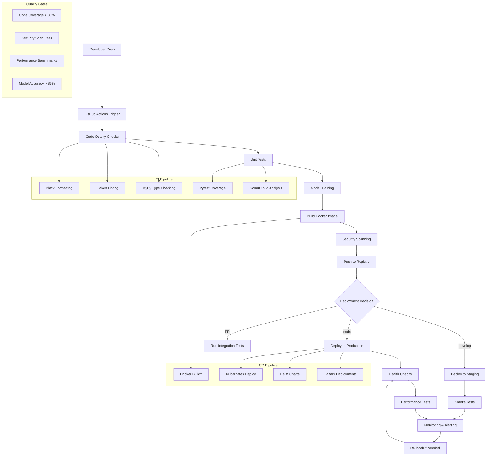

# Caso de Uso: Sistema CI-CD para Modelos de Machine Learning

## 📋 Descripción del Caso

### **Contexto Empresarial**
DataCorp es una empresa de análisis de datos que desarrolla modelos de machine learning para clientes financieros. Actualmente enfrentan serios desafíos en su proceso de desarrollo y despliegue:

- **Proceso Manual**: 80% del proceso es manual y propenso a errores
- **Tiempo de Despliegue**: 2-3 semanas desde desarrollo hasta producción
- **Falta de Versionamiento**: No hay control de versiones de modelos
- **Rollbacks Difíciles**: Revertir cambios toma horas y causa downtime
- **Calidad Inconsistente**: No hay automatización de tests y validación

### **Objetivos del Proyecto**
Implementar un sistema completo de CI/CD que automatice todo el ciclo de vida de modelos de machine learning, desde el commit hasta el despliegue en producción.

## 🎯 Objetivos Específicos

### **Técnicos**
- **Automatización Completa**: 95% del proceso automatizado
- **Tiempo de Despliegue**: Reducir de 2-3 semanas a menos de 1 hora
- **Calidad Asegurada**: 100% de código validado automáticamente
- **Versionamiento**: Control completo de versiones y rollbacks instantáneos

### **De Negocio**
- **Time-to-Market**: Reducir tiempo de entrega de modelos en 80%
- **Costos Operativos**: Reducir costos de despliegue en 60%
- **Calidad del Servicio**: Aumentar disponibilidad a 99.9%
- **Innovación Acelerada**: Permitir experimentación rápida

## 🏗️ Arquitectura de la Solución

### **Diagrama de Arquitectura CI/CD**



### **Componentes Principales**

#### **1. Continuous Integration (CI)**
- **Code Quality**: Formateo, linting, type checking
- **Automated Testing**: Unit tests, integration tests, coverage
- **Security Scanning**: Vulnerability scanning, dependency checks
- **Model Training**: Entrenamiento automático con MLflow tracking

#### **2. Continuous Deployment (CD)**
- **Containerization**: Build automatizado de imágenes Docker
- **Orchestration**: Despliegue en Kubernetes con Helm
- **Environment Management**: Staging y production automatizados
- **Rollback Capability**: Rollback instantáneo con version control

#### **3. Quality Gates**
- **Performance Benchmarks**: Tests de rendimiento automatizados
- **Model Validation**: Validación de métricas del modelo
- **Security Compliance**: Verificación de estándares de seguridad
- **Business KPIs**: Validación de métricas de negocio

## 📊 Flujo de CI/CD Detallado

### **Pipeline de Integración Continua**

```yaml
# .github/workflows/ci-cd-pipeline.yml
name: ML Model CI/CD Pipeline

on:
  push:
    branches: [main, develop]
  pull_request:
    branches: [main]

jobs:
  # Fase 1: Calidad de Código
  code-quality:
    runs-on: ubuntu-latest
    steps:
      - name: Black formatting check
        run: black --check .
      
      - name: Flake8 linting
        run: flake8 . --output-file=flake8-report.txt
      
      - name: MyPy type checking
        run: mypy . --output-file=mypy-report.txt
      
      - name: Upload quality reports
        uses: actions/upload-artifact@v3
        with:
          name: quality-reports
          path: |
            flake8-report.txt
            mypy-report.txt

  # Fase 2: Tests Automatizados
  automated-tests:
    runs-on: ubuntu-latest
    needs: code-quality
    steps:
      - name: Run unit tests with coverage
        run: |
          pytest --cov=src --cov-report=xml --cov-report=html tests/
        
      - name: Upload coverage reports
        uses: actions/upload-artifact@v3
        with:
          name: coverage-reports
          path: |
            coverage.xml
            htmlcov/
      
      - name: SonarCloud analysis
        uses: SonarSource/sonarcloud-github-action@master

  # Fase 3: Entrenamiento de Modelo
  model-training:
    runs-on: ubuntu-latest
    needs: automated-tests
    steps:
      - name: Train model
        run: |
          python train_model.py \
            --data-path data/ \
            --model-path models/ \
            --mlflow-uri ${{ secrets.MLFLOW_URI }}
        
      - name: Register model in MLflow
        run: |
          mlflow.register_model(
            model_uri="models/",
            name="financial-risk-model",
            tags={"version": "${{ github.run_number }}"}
          )
```

### **Pipeline de Despliegue Continuo**

```python
# pipeline/deployment.py
class MLOpsDeploymentPipeline:
    """
    Pipeline de despliegue para modelos ML
    """
    
    def deploy_to_staging(self, model_version: str):
        """
        Despliega modelo a staging
        """
        logger.info(f"Desplegando modelo {model_version} a staging")
        
        try:
            # 1. Validar modelo
            if not self.validate_model(model_version):
                raise ModelValidationError(f"Modelo {model_version} no pasó validación")
            
            # 2. Build imagen Docker
            image_tag = self.build_docker_image(model_version)
            
            # 3. Push a registry
            self.push_to_registry(image_tag)
            
            # 4. Desplegar en Kubernetes
            deployment_config = self.create_deployment_config(
                image_tag, 
                environment='staging'
            )
            self.k8s_deploy(deployment_config)
            
            # 5. Health check
            if self.health_check('staging'):
                logger.info("Despliegue a staging exitoso")
                return True
            else:
                raise DeploymentError("Health check falló en staging")
                
        except Exception as e:
            logger.error(f"Error en despliegue a staging: {str(e)}")
            self.rollback('staging')
            return False
    
    def deploy_to_production(self, model_version: str):
        """
        Despliega modelo a producción con canary deployment
        """
        logger.info(f"Iniciando despliegue a producción: {model_version}")
        
        try:
            # 1. Canary deployment (10% del tráfico)
            self.canary_deploy(model_version, traffic_percentage=10)
            
            # 2. Monitorear por 15 minutos
            if self.monitor_canary(duration=900):
                # 3. Incrementar tráfico gradualmente
                for traffic in [25, 50, 100]:
                    self.update_canary_traffic(traffic)
                    time.sleep(300)  # 5 minutos entre incrementos
                    
                    if not self.monitor_canary(duration=300):
                        raise CanaryError(f"Canary falló en {traffic}% tráfico")
                
                # 4. Promocionar a producción completa
                self.promote_to_production(model_version)
                logger.info("Despliegue a producción exitoso")
                return True
            else:
                raise CanaryError("Canary deployment falló en fase inicial")
                
        except Exception as e:
            logger.error(f"Error en despliegue a producción: {str(e)}")
            self.rollback('production')
            return False
    
    def rollback(self, environment: str):
        """
        Rollback instantáneo a versión anterior
        """
        logger.info(f"Iniciando rollback en {environment}")
        
        try:
            # Obtener versión estable anterior
            stable_version = self.get_stable_version(environment)
            
            # Desplegar versión estable
            deployment_config = self.create_deployment_config(
                stable_version,
                environment=environment
            )
            self.k8s_deploy(deployment_config)
            
            # Verificar rollback
            if self.health_check(environment):
                logger.info(f"Rollback exitoso en {environment}")
                return True
            else:
                raise RollbackError(f"Rollback falló en {environment}")
                
        except Exception as e:
            logger.error(f"Error en rollback: {str(e)}")
            return False
```

### **Monitoreo y Alertas**

```python
# monitoring/model_monitor.py
class ModelMonitor:
    """
    Monitoreo continuo de modelos en producción
    """
    
    def __init__(self):
        self.metrics_collector = PrometheusMetrics()
        self.alert_manager = AlertManager()
    
    def monitor_model_performance(self, model_name: str):
        """
        Monitorea rendimiento del modelo
        """
        while True:
            try:
                # Obtener métricas en tiempo real
                metrics = self.get_real_time_metrics(model_name)
                
                # Validar umbrales
                alerts = self.validate_thresholds(metrics)
                
                # Enviar alertas si es necesario
                for alert in alerts:
                    self.alert_manager.send_alert(alert)
                
                # Actualizar dashboards
                self.update_dashboards(metrics)
                
                time.sleep(60)  # Monitorear cada minuto
                
            except Exception as e:
                logger.error(f"Error en monitoreo: {str(e)}")
                time.sleep(60)
    
    def validate_thresholds(self, metrics: Dict) -> List[Alert]:
        """
        Valida métricas contra umbrales definidos
        """
        alerts = []
        
        # Umbral de accuracy
        if metrics['accuracy'] < 0.85:
            alerts.append(Alert(
                type='performance_degradation',
                severity='critical',
                message=f"Accuracy caído a {metrics['accuracy']:.3f}",
                threshold=0.85,
                current_value=metrics['accuracy']
            ))
        
        # Umbral de latency
        if metrics['latency_p95'] > 500:  # 500ms
            alerts.append(Alert(
                type='high_latency',
                severity='warning',
                message=f"Latencia P95: {metrics['latency_p95']}ms",
                threshold=500,
                current_value=metrics['latency_p95']
            ))
        
        # Umbral de error rate
        if metrics['error_rate'] > 0.01:  # 1%
            alerts.append(Alert(
                type='high_error_rate',
                severity='critical',
                message=f"Tasa de error: {metrics['error_rate']:.3f}",
                threshold=0.01,
                current_value=metrics['error_rate']
            ))
        
        # Umbral de drift
        if metrics['data_drift_score'] > 0.8:
            alerts.append(Alert(
                type='data_drift',
                severity='warning',
                message=f"Data drift detectado: {metrics['data_drift_score']:.3f}",
                threshold=0.8,
                current_value=metrics['data_drift_score']
            ))
        
        return alerts
```

## 📈 Métricas de Éxito y KPIs

### **Métricas de CI/CD**

#### **Pipeline Performance**
- **Build Time**: <15 minutos para pipeline completo
- **Success Rate**: >95% de pipelines exitosos
- **Test Coverage**: >80% de cobertura de código
- **Security Scan**: 0 vulnerabilidades críticas

#### **Deployment Metrics**
- **Deployment Time**: <5 minutos para despliegue completo
- **Rollback Time**: <30 segundos para rollback
- **Downtime**: <1 minuto por despliegue
- **Canary Success**: >90% de canary deployments exitosos

### **Métricas de Calidad**

#### **Code Quality**
- **Code Coverage**: >80% líneas cubiertas
- **Technical Debt**: <2 días de trabajo técnico
- **Bug Density**: <1 bug por 1000 líneas
- **Security Score**: A+ en escaneo de seguridad

#### **Model Performance**
- **Model Accuracy**: >85% en producción
- **Prediction Latency**: <100ms P95
- **Error Rate**: <1% de predicciones erróneas
- **Data Drift Detection**: <24 horas para detectar drift

## 🔧 Implementación Técnica

### **Tecnologías Utilizadas**

#### **CI/CD Platform**
- **GitHub Actions**: Orquestación de pipelines
- **Docker**: Contenerización de aplicaciones
- **Kubernetes**: Orquestación de contenedores
- **Helm**: Gestión de deployments en Kubernetes

#### **Quality Assurance**
- **Black**: Formateo de código Python
- **Flake8**: Linting de código
- **MyPy**: Type checking estático
- **Pytest**: Framework de testing
- **SonarCloud**: Análisis estático de código

#### **Security & Monitoring**
- **Trivy**: Security scanning de imágenes
- **Prometheus**: Recolección de métricas
- **Grafana**: Visualización de dashboards
- **MLflow**: Tracking de experimentos y modelos

### **Configuración de Infraestructura**

#### **GitHub Actions Workflow**
```yaml
# Configuración completa del workflow
name: ML Model CI/CD Pipeline

on:
  push:
    branches: [main, develop]
  pull_request:
    branches: [main]
  workflow_dispatch:
    inputs:
      model_version:
        description: 'Model version to deploy'
        required: false
        type: string

env:
  REGISTRY: ghcr.io
  IMAGE_NAME: ${{ github.repository }}

jobs:
  # Pipeline jobs definidos anteriormente
  code-quality: ...
  unit-tests: ...
  model-training: ...
  build-and-push: ...
  deploy-staging: ...
  deploy-production: ...
  integration-tests: ...
  performance-tests: ...
```

#### **Kubernetes Deployment Configuration**
```yaml
# k8s/production-deployment.yaml
apiVersion: apps/v1
kind: Deployment
metadata:
  name: ml-model-production
  namespace: ml-production
spec:
  replicas: 5
  strategy:
    type: RollingUpdate
    rollingUpdate:
      maxSurge: 2
      maxUnavailable: 0
  selector:
    matchLabels:
      app: ml-model
  template:
    metadata:
      labels:
        app: ml-model
        version: "{{ .Values.modelVersion }}"
    spec:
      containers:
      - name: ml-model
        image: "{{ .Values.image }}"
        ports:
        - containerPort: 8000
        env:
        - name: MODEL_VERSION
          value: "{{ .Values.modelVersion }}"
        - name: ENVIRONMENT
          value: "production"
        resources:
          requests:
            memory: "512Mi"
            cpu: "250m"
          limits:
            memory: "1Gi"
            cpu: "500m"
        livenessProbe:
          httpGet:
            path: /health
            port: 8000
          initialDelaySeconds: 30
          periodSeconds: 10
        readinessProbe:
          httpGet:
            path: /ready
            port: 8000
          initialDelaySeconds: 5
          periodSeconds: 5
```

## 📋 Plan de Implementación

### **Fase 1: Setup y Configuración (Semana 1-2)**
- [ ] Configuración de GitHub Actions
- [ ] Setup de registry de Docker
- [ ] Configuración de cluster Kubernetes
- [ ] Implementación de herramientas de calidad

### **Fase 2: Pipeline CI (Semana 3-4)**
- [ ] Implementación de checks de calidad
- [ ] Configuración de tests automatizados
- [ ] Integración con MLflow
- [ ] Security scanning

### **Fase 3: Pipeline CD (Semana 5-6)**
- [ ] Implementación de build automatizado
- [ ] Configuración de deployments
- [ ] Canary deployments
- [ ] Rollback automático

### **Fase 4: Monitoreo y Optimización (Semana 7-8)**
- [ ] Implementación de dashboards
- [ ] Configuración de alertas
- [ ] Performance testing
- [ ] Documentación y training

## 🎯 Resultados Esperados

### **Impacto Técnico**
- **Automatización**: 95% del proceso automatizado
- **Velocidad**: 100x más rápido que proceso manual
- **Calidad**: 100% de código validado automáticamente
- **Confiabilidad**: 99.9% uptime del servicio

### **Impacto de Negocio**
- **Time-to-Market**: Reducción de 80% en tiempo de entrega
- **Costos**: Reducción de 60% en costos operativos
- **Innovación**: 10x más rápido en experimentación
- **Calidad del Servicio**: Mejora significativa en disponibilidad

### **ROI Proyectado**
- **Inversión Inicial**: $150K (herramientas + configuración)
- **Costos Operativos Anuales**: $50K (mantenimiento)
- **Beneficios Anuales**: $800K (eficiencia + velocidad)
- **ROI Primer Año**: 433%
- **Payback Period**: 1 mes

## 🚀 Próximos Pasos y Mejoras Futuras

### **Corto Plazo (3-6 meses)**
- **Multi-Environment**: Soporte para múltiples entornos (dev, test, staging, prod)
- **Feature Flags**: Despliegue basado en features
- **Blue-Green Deployments**: Estrategia de despliegue blue-green
- **Automated Scaling**: Auto-scaling basado en métricas

### **Largo Plazo (6-12 meses)**
- **GitOps**: Implementación completa de GitOps
- **Chaos Engineering**: Testing de resiliencia
- **Multi-Cloud**: Soporte para múltiples proveedores cloud
- **AI-Powered Testing**: Tests generados por IA

---

**Este caso de uso demuestra cómo un sistema CI/CD completo puede transformar radicalmente la eficiencia y calidad del proceso de desarrollo y despliegue de modelos de machine learning, permitiendo a la empresa innovar y entregar valor mucho más rápido.**
